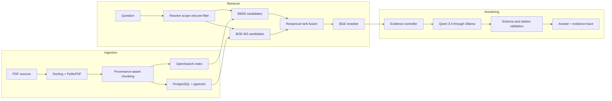

# RaceVault

Ask a question about a race car and get an answer with the page it came from.

RaceVault searches a private library of motorsport PDFs: championship regulations, Porsche technical manuals, tyre data, part catalogues, and component documentation. It finds the passages that answer your question, then a local language model writes the answer and cites the passages it used. Nothing leaves your machine.


## Why a motorsport corpus is hard

A general document search fails on these documents for four specific reasons. The pipeline handles each one, rather than rules written for each question.

### The rulebook changed this year

Ask for the minimum car weight in Carrera Cup Australia. The 2025 regulations say 1295 kg. The 2026 regulations say 1300 kg, under a renumbered clause. Six of the nine championships in the corpus carry both editions, so a search that ignores the year can return either one.

RaceVault resolves the championship you named to its newest season and revision before it searches. A year you name yourself takes precedence, and each side of a comparison resolves on its own, so a question never sets one season against another by accident.

### The same part has three names

An Australian regulation writes `tyre`; a North American one writes `tire`. A supplier writes `shock absorber` where a workshop manual writes `damper`. The rulebook legislates about the `Automobile` while you ask about the `car`.

A synonym graph and a light stemmer close that gap at search time, so you extend the vocabulary without rebuilding the index. Keyword ranking improved from 0.717 to 0.788 MRR, with no question ranking worse. There is no stop-word filter, because a regulation that says `shall` means something different from one that says `should`.

### Part numbers are not words

`9F1615427D` and `992.2` have to match character for character. Questions about concepts need the opposite behaviour. RaceVault indexes every text field twice: one analyzer reads it as prose, and a second keeps the periods, slashes, and hyphens inside an identifier.

### Sometimes the answer is not in the library

Search always returns its best guess, however poor. RaceVault scores that guess against a threshold and says what is missing instead of writing a confident answer from weak evidence. RaceVault calibrates that threshold on a development set and freezes it before the held-out set runs. Answerable and unanswerable questions separate by roughly a factor of ten.

## Pipeline



Two search engines run over the same passages. OpenSearch matches exact words. BGE-M3 matches meaning. They fail on different questions, so merging their rankings recovers passages that either one alone misses. A cross-encoder then rescores the survivors by reading each passage against the question.

An evidence controller then picks what the language model sees. It covers every championship the question named, splits a compound question into subtopics and searches each one, drops near-duplicates, and abstains if nothing scores well enough. The API rejects any answer that cites a passage it was not given.

Chunking preserves page, clause, table, and section boundaries, and carries coordinates and hashes through every stage. That is what lets an answer point at a page.

## Results

Measured on the 64-document corpus: 4,888 pages, 9,212 passages.

Held-out test split of `racevault-corpus-v2`, 13 questions never used for tuning:

| Stage | Hit rate | MRR | nDCG@10 | Recall@10 |
| --- | ---: | ---: | ---: | ---: |
| BM25 | 1.000 | 0.847 | 0.797 | 0.889 |
| BGE-M3 | 1.000 | 0.889 | 0.832 | 0.889 |
| Fusion | 1.000 | 0.870 | 0.817 | 0.889 |
| Reranked | 1.000 | 0.944 | 0.894 | 0.944 |

At the frozen threshold, RaceVault answers 9 of 9 answerable held-out questions and abstains on 4 of 4 that the corpus cannot answer.

Answer latency on a 12 GB NVIDIA RTX 4070, with models resident:

| Question | Retrieval | Generation | Total |
| --- | ---: | ---: | ---: |
| Single regulation fact | 0.35 s | 4.46 s | 4.82 s |
| Component specification | 0.43 s | 6.37 s | 6.81 s |
| Compound, three subtopics | 0.95 s | 14.33 s | 15.29 s |

Generation dominates, at about 60 tokens per second. Model loading and connection setup, not inference, accounted for an earlier 26.0-second mean.

The dataset holds 40 questions across nine document families, split so that no family appears in both development and test. Its labels are author-verified rather than independently annotated, so this is a regression baseline, not a general quality claim. For the workflow, see [Evaluation and corpus operations](docs/evaluation-and-corpus.md).

## Interface

<table>
  <tr>
    <td width="50%"></td>
    <td width="50%"></td>
  </tr>
  <tr>
    <td><strong>Source catalogue.</strong> Add, filter, scope, and remove indexed PDFs. Vector coverage shows whether every stored passage has an embedding.</td>
    <td><strong>Document comparison.</strong> Run one question against two sources and read the retrieved passages side by side.</td>
  </tr>
</table>

## Quick start

You need Docker Desktop, Ollama running on the host, and an NVIDIA GPU for reasonable speed.

Create the environment file and pull the model:

```powershell
Copy-Item .env.example .env
ollama pull qwen3.5:9b
```

On macOS or Linux, use `cp .env.example .env` for the first command.

Start the stack and apply the database migrations:

```powershell
docker compose -f compose.yaml -f compose.dev.yaml up --build -d
docker compose -f compose.yaml -f compose.dev.yaml exec api alembic upgrade head
```

Open the web interface at `http://localhost:3000`, and the API documentation at `http://localhost:8000/docs`.

To give the API container access to an NVIDIA GPU, add `-f compose.gpu.yaml` to the commands. To stop the stack and keep the data, run `docker compose down`.

Add your own PDFs from the Sources page. RaceVault runs extraction, chunking, embedding, and indexing as one job.

## Configuration

`.env.example` documents every setting. The ones that change behaviour most:

| Variable | Default | Purpose |
| --- | --- | --- |
| `RACEVAULT_RETRIEVAL_PREFER_LATEST_EDITION` | `true` | Resolves a championship to its newest season and revision |
| `RACEVAULT_ANSWER_MINIMUM_RERANKER_SCORE` | `0.2377` | Score below which RaceVault abstains |
| `RACEVAULT_ANSWER_EVIDENCE_LIMIT` | `8` | Passages sent to the model |
| `RACEVAULT_OLLAMA_KEEP_ALIVE` | `5m` | How long Ollama holds the model in memory |
| `RACEVAULT_ANSWER_RELEASE_RETRIEVAL_MODELS` | `false` | Releases the embedder and reranker after each answer |

The defaults keep all three models resident, which needs about 10 GB of video memory. To run on a smaller GPU, set `RACEVAULT_ANSWER_RELEASE_RETRIEVAL_MODELS=true` and `RACEVAULT_OLLAMA_KEEP_ALIVE=0`, and expect about 14 seconds of extra loading per answer.

Set `RACEVAULT_OLLAMA_URL` to `http://127.0.0.1:11434` rather than `localhost` on any host whose resolver returns `::1` first. Ollama listens on IPv4 only, so each connection to `localhost` waits about two seconds for the IPv6 attempt to fail.

## Development

Run the backend checks:

```powershell
python -m pip install -e ".\backend[dev,extraction,semantic]"
python -m pytest backend/tests
python -m ruff check backend scripts
python -m mypy --config-file backend/pyproject.toml backend/src
```

Run the frontend checks:

```powershell
npm --prefix frontend install
npm --prefix frontend run lint
npm --prefix frontend run typecheck
npm --prefix frontend run build
```

The repository passes 183 backend tests, frontend linting, type checking, and the production frontend build. The extraction and semantic extras pull large machine-learning dependencies, so Docker is the shorter path when those packages are not already on the host.

## Limits

- Answering is single-turn. RaceVault does not use previous questions as context.
- The API returns a complete answer. It does not stream tokens.
- Citation validation confirms the structure and the identifiers. It does not prove that a citation entails the claim.
- Abstention rests on a retrieval score. A confident score on a passage that misses the point still reaches the model.
- Retrieval is text only. RaceVault does not read pages as images.
- Extraction quality follows the source PDF, which matters most for scanned pages and complex tables.
- Verify any decision that affects a car against the original document and its applicable revision.

## Documentation

Pipeline stages:
[Extraction](docs/extraction.md) &middot;
[Chunking](docs/chunking.md) &middot;
[Metadata model](docs/metadata-model.md) &middot;
[Lexical retrieval](docs/lexical-retrieval.md) &middot;
[Semantic retrieval](docs/semantic-retrieval.md) &middot;
[Hybrid retrieval](docs/hybrid-retrieval.md) &middot;
[Evidence controller](docs/evidence-controller.md) &middot;
[Grounded generation](docs/grounded-generation.md)

Interfaces:
[Product API](docs/product-api.md) &middot;
[Evidence interface](docs/evidence-interface.md)

Evaluation and operations:
[Evaluation and corpus](docs/evaluation-and-corpus.md) &middot;
[Technical report](docs/technical-report.md) &middot;
[Operations and recovery](docs/operations.md) &middot;
[Design decisions](docs/design-decisions.md)

Cards:
[System card](docs/system-card.md) &middot;
[Data card](docs/data-card.md) &middot;
[Model card](docs/model-card.md) &middot;
[Milestones](docs/milestones.md)
