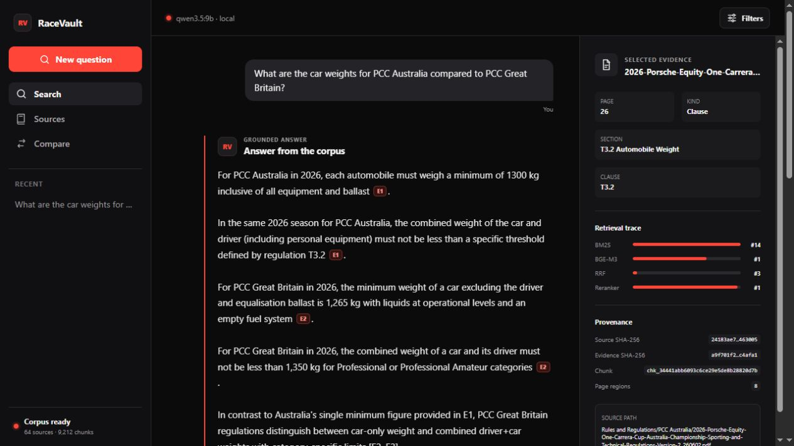
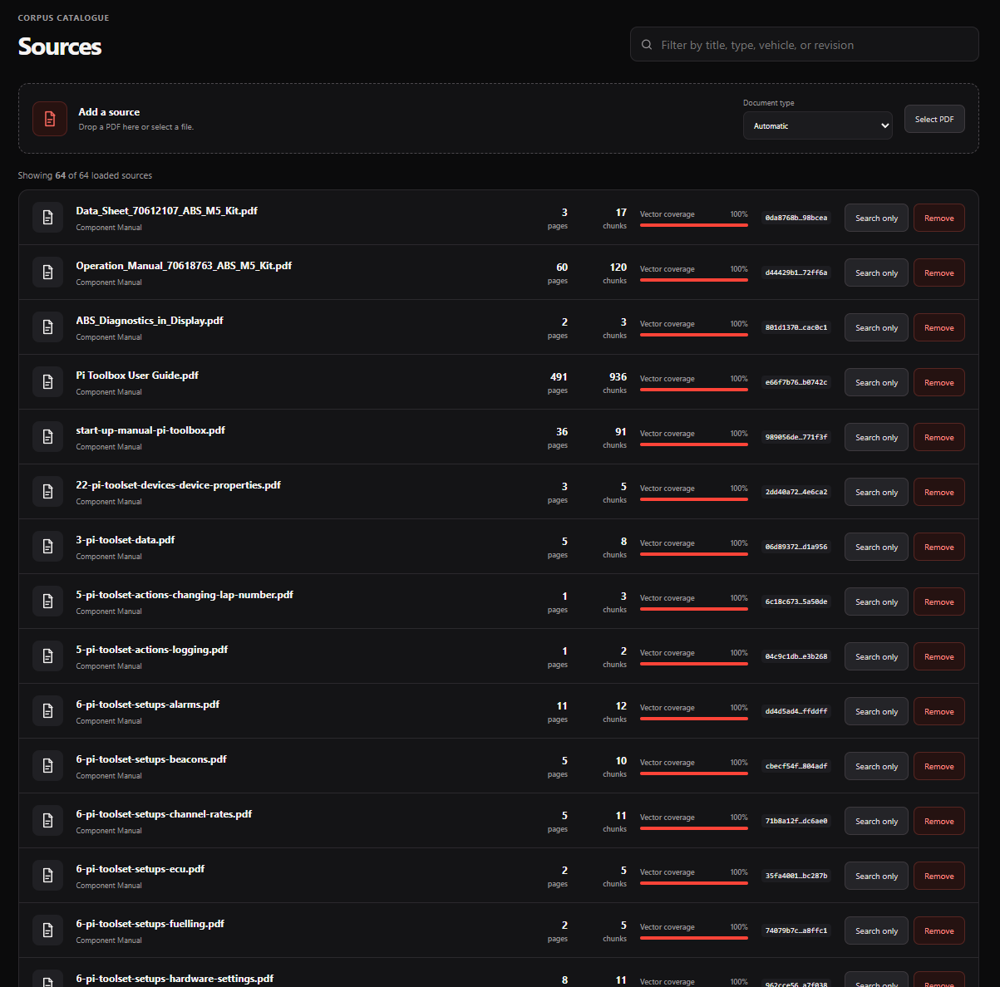
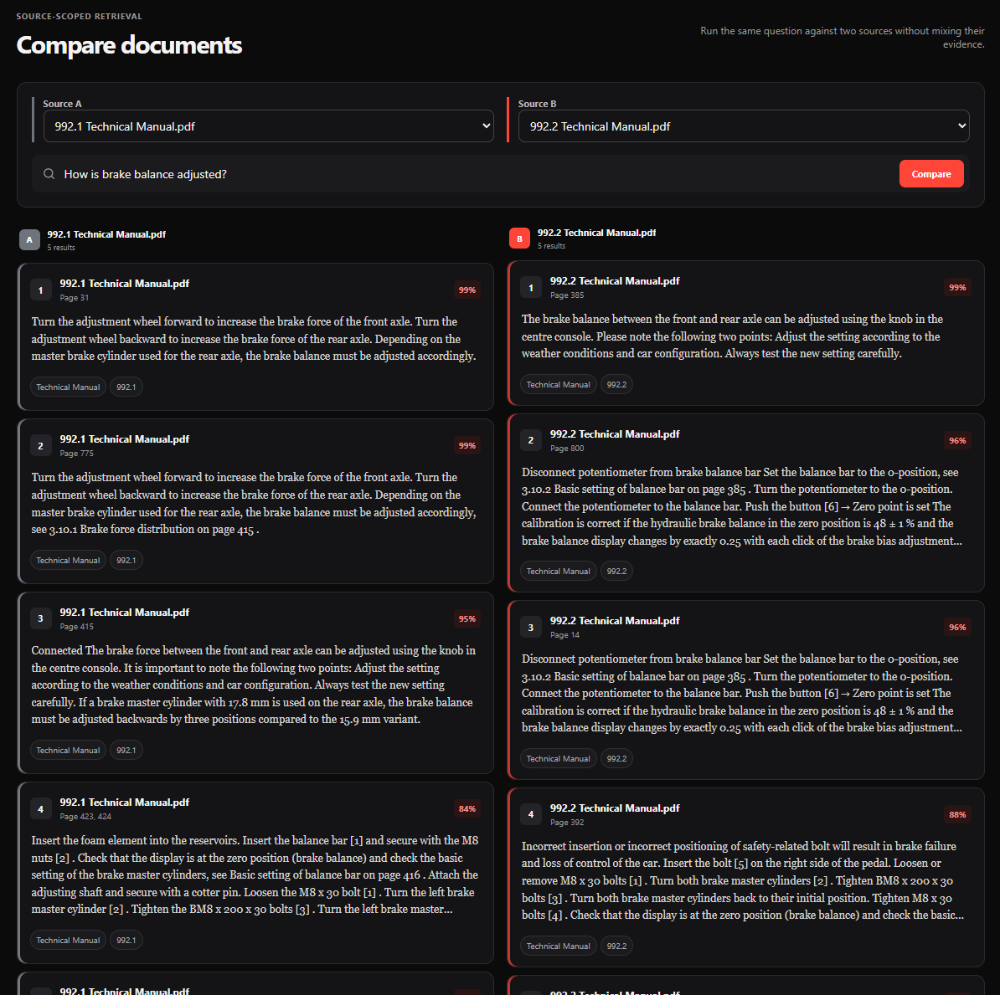
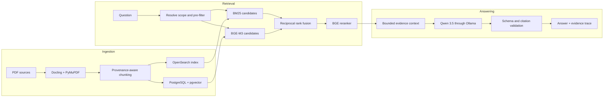

# RaceVault

RaceVault is a custom retrieval-augmented generation (RAG) system for motorsport technical documents. It searches manuals, regulations, component documentation, part catalogues, and engineering references, then returns an answer linked to the source evidence.




## Overview

Motorsport documents are difficult to search as a single corpus. A technically relevant passage can still be wrong for the selected vehicle, championship, season, or revision. Exact terms such as part numbers and regulation clauses also behave differently from natural-language questions.

RaceVault addresses these problems with:

- metadata pre-filtering before retrieval;
- BM25 keyword retrieval for exact terms;
- BGE-M3 semantic retrieval for concepts and synonyms;
- reciprocal rank fusion and cross-encoder reranking;
- page-, clause-, table-, and section-aware chunks;
- source citations and a visible retrieval trace;
- local answer generation through Ollama and Qwen 3.5 9B.

The original document remains the authoritative source. RaceVault is designed to make that evidence easier to find and compare.

## Features

- Ask questions across a local PDF corpus.
- Limit retrieval by championship, vehicle, season, revision, document type, or source.
- Inspect the evidence used for each answer.
- View BM25, semantic, fusion, and reranker positions.
- Add a PDF from the Sources page and process it through the full ingestion pipeline.
- Remove a source and its chunks, vectors, and search-index records.
- Search only within a selected source.
- Compare the same question against two documents without mixing their evidence.
- Run the application without a paid model API.

## Interface

<table>
  <tr>
    <td width="50%"></td>
    <td width="50%"></td>
  </tr>
  <tr>
    <td><strong>Source catalogue.</strong> Add, filter, inspect, scope, and remove indexed PDFs. Vector coverage shows whether every stored chunk has an embedding.</td>
    <td><strong>Document comparison.</strong> Run one question against two independently scoped sources and inspect the retrieved passages side by side.</td>
  </tr>
</table>

## How it works



### Ingestion

1. Docling extracts document structure. PyMuPDF provides page text, coordinates, and fallback extraction.
2. Custom chunking preserves document, page, section, clause, table, and bounding-box metadata.
3. Chunks are stored in PostgreSQL.
4. BGE-M3 creates one dense embedding per chunk. The vectors are stored with the chunks through pgvector.
5. The same chunks are indexed in OpenSearch for BM25 retrieval.

### Retrieval and answering

1. RaceVault resolves explicit source and corpus metadata from the question.
2. Metadata filters restrict the valid search space before BM25 and BGE-M3 run.
3. OpenSearch returns lexical candidates. pgvector returns semantic candidates using an embedded query.
4. Reciprocal rank fusion combines the two result lists.
5. BGE-reranker-v2-m3 scores the fused candidates.
6. A bounded evidence set is sent to Qwen 3.5 9B through Ollama.
7. The API validates the response schema and citations before returning the answer.

## Technology stack

| Area | Technology | Purpose |
| --- | --- | --- |
| Web interface | Next.js 16, React 19, TypeScript | Search, source management, comparison, and evidence inspection |
| API | FastAPI, Pydantic | Query, ingestion, source, and health endpoints |
| Document processing | Docling, PyMuPDF | Structured PDF extraction and page-level fallback data |
| Metadata and chunks | PostgreSQL | Source records, chunk text, provenance, and application state |
| Semantic retrieval | BGE-M3, pgvector | Dense document embeddings and nearest-neighbour search |
| Lexical retrieval | OpenSearch | BM25 search over the same chunk corpus |
| Fusion and reranking | RRF, BGE-reranker-v2-m3 | Candidate merging and final relevance ordering |
| Answer generation | Ollama, Qwen 3.5 9B | Local grounded-answer generation |
| Runtime | Docker Compose | Repeatable local services and optional GPU access |

## Quick start

### Requirements

- Docker Desktop with Docker Compose
- Ollama running on the host
- `qwen3.5:9b` available in Ollama
- An NVIDIA GPU and compatible drivers if you use `compose.gpu.yaml`

Python and Node.js are only required when running development tools directly on the host.

### Start the application

From the repository root, create the local environment file:

```powershell
Copy-Item .env.example .env
ollama pull qwen3.5:9b
```

On macOS or Linux, replace the first command with `cp .env.example .env`.

Start the development stack:

```powershell
docker compose -f compose.yaml -f compose.dev.yaml up --build -d
docker compose -f compose.yaml -f compose.dev.yaml exec api alembic upgrade head
docker compose -f compose.yaml -f compose.dev.yaml ps
```

Open:

- Web interface: [http://localhost:3000](http://localhost:3000)
- API documentation: [http://localhost:8000/docs](http://localhost:8000/docs)
- OpenSearch: [http://localhost:9200](http://localhost:9200)

The development override bind-mounts `backend/src` and enables Uvicorn reload. Backend source changes do not require rebuilding the image or reinstalling Torch, CUDA, Docling, and Transformers.

To give the API container access to an NVIDIA GPU, include the GPU override:

```powershell
docker compose -f compose.yaml -f compose.dev.yaml -f compose.gpu.yaml up --build -d
```

### Stop the application

```powershell
docker compose down
```

This stops the services and preserves the database, OpenSearch index, and model caches in Docker volumes.

## Configuration

The defaults in `.env.example` are intended for local development. Common settings include:

| Variable | Default | Purpose |
| --- | --- | --- |
| `RACEVAULT_OLLAMA_MODEL` | `qwen3.5:9b` | Ollama model used for answer generation |
| `RACEVAULT_API_MODEL_DEVICE` | `auto` | Device used for embedding and reranking outside the GPU override |
| `RACEVAULT_OLLAMA_CONTEXT_TOKENS` | `16384` | Model context window requested from Ollama |
| `RACEVAULT_OLLAMA_MAX_OUTPUT_TOKENS` | `3072` | Maximum generated output before validation |
| `RACEVAULT_ANSWER_RETRIEVAL_CANDIDATE_LIMIT` | `20` | Reranked passages considered by the evidence controller |
| `RACEVAULT_ANSWER_FACET_CANDIDATE_LIMIT` | `8` | Passages retrieved for each explicit subtopic in a compound question |
| `RACEVAULT_ANSWER_MAX_QUERY_FACETS` | `6` | Maximum explicit subtopics searched independently |
| `RACEVAULT_ANSWER_EVIDENCE_LIMIT` | `8` | Normal evidence-passage budget for an answer |
| `RACEVAULT_ANSWER_MAX_EVIDENCE_LIMIT` | `10` | Maximum evidence passages for expanded multi-scope questions |
| `RACEVAULT_ANSWER_EVIDENCE_CHARACTER_BUDGET` | `24000` | Maximum evidence text supplied to the generator |

Compose connects the API container to host Ollama through `host.docker.internal:11434`. See `.env.example` for database, OpenSearch, extraction, chunking, embedding, and reranking settings.

## Add documents

Open the **Sources** page, then drag a PDF into **Add a source** or select it from the file picker. RaceVault performs extraction, chunking, embedding, and lexical indexing as one ingestion job.

Removing an uploaded source deletes its database record, chunks, embeddings, and OpenSearch records. It does not delete PDFs from the repository corpus.

For bulk corpus ingestion, metadata review, and reindexing commands, see [Evaluation and corpus operations](docs/evaluation-and-corpus.md).

## Use the API

The interactive API documentation is available at [http://localhost:8000/docs](http://localhost:8000/docs).

Example PowerShell request:

```powershell
$body = @{
  query = "What are the car weights for PCC Australia and PCC Great Britain?"
  filters = @{
    season = 2026
  }
} | ConvertTo-Json -Depth 4

Invoke-RestMethod `
  -Method Post `
  -Uri http://localhost:8000/v2/answers `
  -ContentType "application/json" `
  -Body $body
```

Use `/v1/retrieval/search` when you need retrieved evidence without answer generation. Use `/v2/answers` when you need a grounded answer and citations.

## Development checks

Install the backend packages when you need to run checks outside Docker:

```powershell
python -m pip install -e ".\backend[dev,extraction,semantic]"
```

Run backend checks:

```powershell
python -m pytest backend/tests
python -m ruff check backend scripts
python -m mypy --config-file backend/pyproject.toml backend/src
```

Run frontend checks:

```powershell
npm --prefix frontend install
npm --prefix frontend run lint
npm --prefix frontend run typecheck
npm --prefix frontend run build
```

The extraction and semantic extras install large machine-learning dependencies. Docker is the simpler development path when those packages are not already available on the host.

## Engineering decisions and lessons

| Problem observed | Decision | Result |
| --- | --- | --- |
| Relevant passages from the wrong championship or season entered the candidate pool. | Resolve metadata from the query and pre-filter both retrieval channels. | BM25 and BGE-M3 search the same valid scope instead of discarding invalid results after fusion. |
| Exact identifiers and natural-language synonyms need different matching behaviour. | Use BM25 and BGE-M3 as complementary channels. | BM25 handles clauses, part numbers, and model codes; BGE-M3 handles terms such as *car*, *automobile*, and *vehicle*. |
| A multi-championship question could spend the candidate budget on the first scopes found. | Run retrieval per named scope and interleave scoped candidates before reranking. | Comparisons retain evidence coverage for each requested championship. |
| Extracted text was useful, but its origin was easy to lose during retrieval. | Carry page, section, clause, coordinates, hashes, and source metadata through every pipeline stage. | Answers can expose the passage and retrieval trace used to produce them. |
| A local model could return truncated JSON at a small output limit. | Increase the output budget, simplify the response schema, and validate every cited evidence identifier. | Invalid or incomplete model output is rejected instead of being presented as a grounded answer. |
| Embedding, reranking, and generation competed for limited GPU memory. | Release retrieval models before generation and unload the local Ollama model after a request when configured. | The full pipeline can run on a single development GPU, with a latency trade-off. |
| Small backend changes triggered installation and export of the full ML dependency layer. | Install locked dependencies before copying application source and bind-mount source in development. | Python edits reload without rebuilding Torch, CUDA, Docling, or Transformers. |
| PDF import failed in the Linux image with `libxcb.so.1` missing. | Install the required native XCB runtime libraries in the API image. | Docling and its OpenCV dependencies can import during ingestion. |
| Inconsistent championship metadata prevented valid pre-filters. | Canonicalize metadata and refresh stored source and chunk metadata. | Explicit scopes map to the intended corpus documents without hard-coded question rules. |

These decisions are implemented as general pipeline behaviour. They do not depend on a fixed list of user questions.

## Current validation baseline

The current corpus baseline contains 64 documents, 4,888 pages, and 9,212 chunks.
The `racevault-corpus-v2` dataset holds 40 queries: 31 answerable and 9
out-of-corpus, across nine document families split development/test with no
family crossing the boundary.

Held-out test split (13 queries, never used for tuning):

| Retrieval stage | Hit rate | MRR | nDCG@10 | Recall@10 |
| --- | ---: | ---: | ---: | ---: |
| BM25 | 1.000 | 0.847 | 0.797 | 0.889 |
| BGE-M3 | 1.000 | 0.889 | 0.832 | 0.889 |
| RRF | 1.000 | 0.870 | 0.817 | 0.889 |
| Reranked | 1.000 | 0.944 | 0.894 | 0.944 |

Abstention is governed by a reranker-score threshold calibrated on the
development split alone and frozen before held-out use. At that threshold the
system answers 9 of 9 answerable held-out queries and abstains on 4 of 4
out-of-corpus ones.

Forty queries over a single corpus remain a regression baseline, not a general
retrieval-quality claim. See [Evaluation and corpus operations](docs/evaluation-and-corpus.md)
for the evaluation workflow and generated reports.

### Evaluation v2 and operations

RaceVault now includes the framework for a held-out, graded benchmark without
overstating unfinished human annotation:

- graded relevance with nDCG@10, Recall@5/10/20, MRR, context precision, and
  negative-query accuracy;
- deterministic bootstrap confidence intervals and paired stage comparisons;
- development/test document-family leakage checks and claim-level grounding
  judgements;
- commit-, dataset-, model-, configuration-, hardware-, and seed-fingerprinted
  reports;
- deterministic CC0 PDF fixtures and a v2 example dataset;
- request IDs, Prometheus metrics, optional OTLP traces, a bounded generation
  queue, and an optional Grafana/Jaeger stack;
- a frozen visual-retrieval promotion gate and dependency-free MaxSim reference
  implementation.

Validate the public reproducibility assets:

```powershell
python scripts/run_benchmark.py quick
```

Run a fingerprinted benchmark after the retrieval services and corpus are loaded:

```powershell
python scripts/run_benchmark.py full --split all --device cuda --local-files-only
```

Use `--split test` only with the completed v2 dataset; the legacy dataset has no
held-out split.

Start the optional operations stack:

```powershell
docker compose -f compose.yaml -f compose.observability.yaml up --build -d
```

Prometheus is then available on port 9090, Grafana on port 3001, and Jaeger on
port 16686. Raw questions and evidence are never metric labels or trace
attributes.

The latest repository checks also pass 109 backend tests, frontend linting,
TypeScript checking, and the production frontend build.

### Evidence intelligence

Grounded generation now uses a deterministic, query-aware evidence controller
instead of blindly packing the first N chunks. It preserves requested scope
coverage, rewards passages that cover the question's meaningful topic terms,
decomposes explicit multi-part requests into bounded facet searches, guarantees
facet evidence coverage, removes near-duplicates, diversifies conflict evidence
across sources, and can abstain before generation using a development-calibrated
reranker threshold. Generated compound answers must account for every facet.
The existing hybrid retrieval pipeline remains unchanged.

See [Evidence intelligence controller](docs/evidence-controller.md) for the
leakage-safe calibration workflow and required control-versus-controller
ablation.

## Repository layout

```text
race-vault/
|-- backend/                 FastAPI application, retrieval, ingestion, and tests
|-- frontend/                Next.js interface
|-- migrations/              Alembic database migrations
|-- scripts/                 Corpus, indexing, evaluation, and diagnostic commands
|-- evaluation/              Query sets and generated evaluation reports
|-- docs/                    Architecture and subsystem documentation
|-- corpus/                  Local source-document directory
|-- compose.yaml             Base application stack
|-- compose.dev.yaml         Source mounts and backend reload
|-- compose.gpu.yaml         Optional NVIDIA GPU access
`-- .env.example             Local configuration template
```

## Current limits

- Answering is single-turn. Previous questions are not used as retrieval context.
- Answers are returned after generation completes; token streaming is not implemented.
- Citation validation confirms structure and evidence identifiers. It does not prove that every generated claim is entailed by its citation.
- Text retrieval is the primary path. Visual page retrieval is not implemented.
- OCR and complex tables remain dependent on the quality of the source PDF and extraction output.
- Motorsport decisions must be verified against the original document and its applicable revision.

## Documentation

- [Product API](docs/product-api.md)
- [Evidence interface](docs/evidence-interface.md)
- [Extraction](docs/extraction.md)
- [Chunking](docs/chunking.md)
- [Metadata model](docs/metadata-model.md)
- [Lexical retrieval](docs/lexical-retrieval.md)
- [Semantic retrieval](docs/semantic-retrieval.md)
- [Hybrid retrieval](docs/hybrid-retrieval.md)
- [Grounded generation](docs/grounded-generation.md)
- [Evaluation and corpus operations](docs/evaluation-and-corpus.md)
- [Milestones](docs/milestones.md)
- [System card](docs/system-card.md)
- [Data card](docs/data-card.md)
- [Model card](docs/model-card.md)
- [Technical report](docs/technical-report.md)
- [Operations and recovery](docs/operations.md)
- [Evidence intelligence controller](docs/evidence-controller.md)
